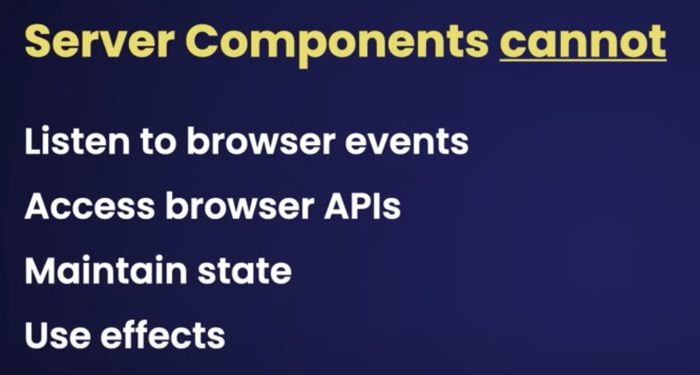
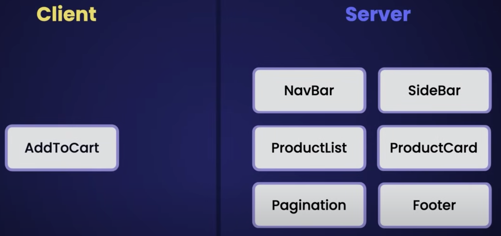
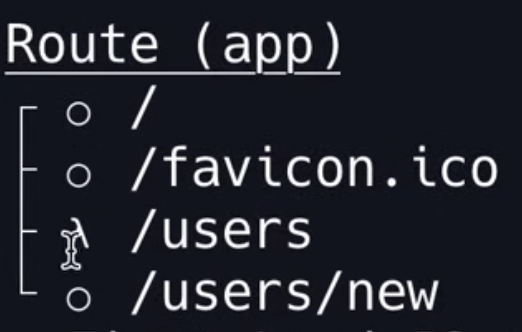
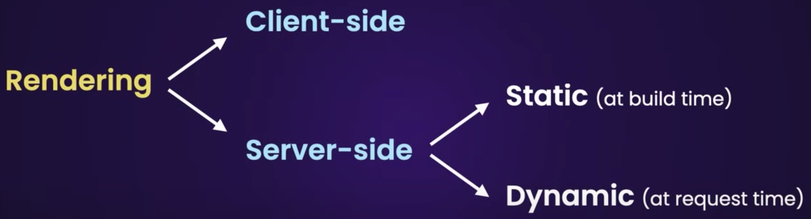
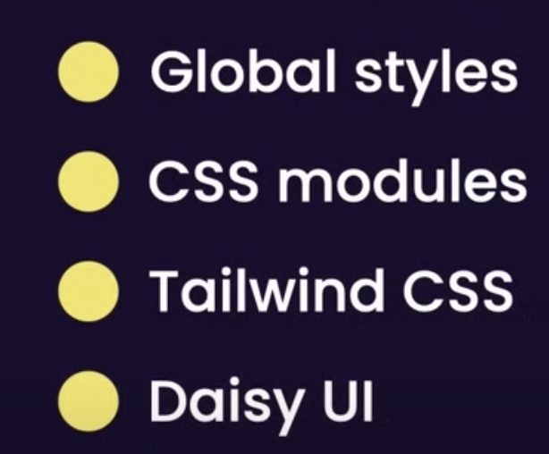

This is a [Next.js](https://nextjs.org/) project bootstrapped with [`create-next-app`](https://github.com/vercel/next.js/tree/canary/packages/create-next-app).

deployed site: https://next-app-ten-azure.vercel.app/

## Getting Started

First, run the development server:

```bash
npm run dev
# or
yarn dev
# or
pnpm dev
```

Open [http://localhost:3000](http://localhost:3000) with your browser to see the result.

You can start editing the page by modifying `app/page.tsx`. The page auto-updates as you edit the file.

This project uses [`next/font`](https://nextjs.org/docs/basic-features/font-optimization) to automatically optimize and load Inter, a custom Google Font.

## Learn More

To learn more about Next.js, take a look at the following resources:

- [Next.js Documentation](https://nextjs.org/docs) - learn about Next.js features and API.
- [Learn Next.js](https://nextjs.org/learn) - an interactive Next.js tutorial.

You can check out [the Next.js GitHub repository](https://github.com/vercel/next.js/) - your feedback and contributions are welcome!

## Deploy on Vercel

The easiest way to deploy your Next.js app is to use the [Vercel Platform](https://vercel.com/new?utm_medium=default-template&filter=next.js&utm_source=create-next-app&utm_campaign=create-next-app-readme) from the creators of Next.js.

Check out our [Next.js deployment documentation](https://nextjs.org/docs/deployment) for more details.

## Personal notes:

video: https://www.youtube.com/watch?v=ZVnjOPwW4ZA
tuto repo: https://members.codewithmosh.com/courses/enrolled/240431

carlosalvarado in ~/Documents/CARLOS_3_09_23/Current Personal/2023/Consultant/Dev/projects $ npx create-next-app@13.4
Need to install the following packages:
create-next-app@13.4.19
Ok to proceed? (y) y
✔ What is your project named? … next_app
✔ Would you like to use TypeScript? Yes
✔ Would you like to use ESLint? Yes
✔ Would you like to use Tailwind CSS? Yes ----> so that we can use ctrl + space to see intelligence suggestions
✔ Would you like to use `src/` directory? … No
✔ Would you like to use App Router? (recommended) Yes
✔ Would you like to customize the default import alias? … No

### Adding new pages

Navigation and new pages structured is built in.
just adding new folders in the three under app directory, it will load the pages automaticaaly.
eg. adding a folder with a name for the route, and a file thats named Page.tsx (for typescript)

Navigation:
we use

> import Link from "next/link";

as we call it client side navigation to optimize what its being downloaded

## Client-side Components CSC vs Server-side components SSC

we should default to Server-side components and do as minimal Client-side components



note that server side components limit the interactivity with the user, so we use the Atomic desing to decouple a strategy.



### Pages router vs New app router

Pages router its deprecated, it does not support server components so you should stop using it

'use client' decorator. we use this to tell nextjs this file will be rendered in the browser

Fetching data:

using jsonplaceholder.typicode.com to get random data

to fetch data, whenever possible, we should fetch it from server-side components

### Caching

there are 3 places to get data.

- Memory (fast)
- File system (mid)
- Network (slow)

by default, nextjs stores data in its file system as cache. it is built in.
we need to be explicit to disable this in each fetch so for those data that changes a lot and we need it from the source.
{ cache: no-store},
or we can add: {next: { revalidate: 10 }} // this would refetch for new data every 10 seconds

### Static and Dynamic Rendering

if we hace pages or components with static data, to be render once only, payload and content will come from chache in its file system

testing static pages:
you need to build the app for production, and because next is using the default cache, it renders statically. avoiding to run a new fetch to the network. unless we add the param to the fetch built in module: { cache: "no-store" }

> npm run build // to create a new build
> npm run start // to run the prod build

when you build, you can identify which page is static or dynamic



### Styling nextjs applicaitons



#### CSS Modules.

it helps to prevent a named class does not override with other. this ocurrs when we import files with same class names,
we use css modules to separate their concern.
as the javascript engine takes care of it, we need to keep the class names as key for objects in javascript.
meaning we should not use - in names like: class-name, we use camelCase: className

#### postcss.config.js

this file helps configure so that css modules work in nextjs. the idea is to autogenerate new classnames so that even if we repeat names. they wont crash

#### Tailwind

one benefit is many classes out of the box, and whenever a component is removed with its class, if the class is not used anywhere else, then the build will not include that class anymore. helping to clean the code automatically.

#### Daisy UI

This is a boostrap for tailwind
install: https://daisyui.com/docs/install/

#### special files in Nextjs

page.tsx: We already used this to create our pages.
layout.tsx: Defined to create the layouts per folder.
loading.tsx: Optional loading component can be used to show a loading state.
error.tsx: Optional error state can be used only to show the error in a specific application part.
template.tsx: Optional and very similar to layout, but this one will always remount on navigation, and the state is not shared.
head.tsx: Optional to add a different <head> tag for a specific route.

#### About navigation with Link

only downloads the content of the target page.
pre-fetches link that are in portview
caches pages on the client

#### Navigation

note that next/router ----> useRouter is depricated:

> Unhandled Runtime Error
> Error: NextRouter was not mounted. https://nextjs.org/docs/messages/next-router-not-mounted

instead use next/navigation
