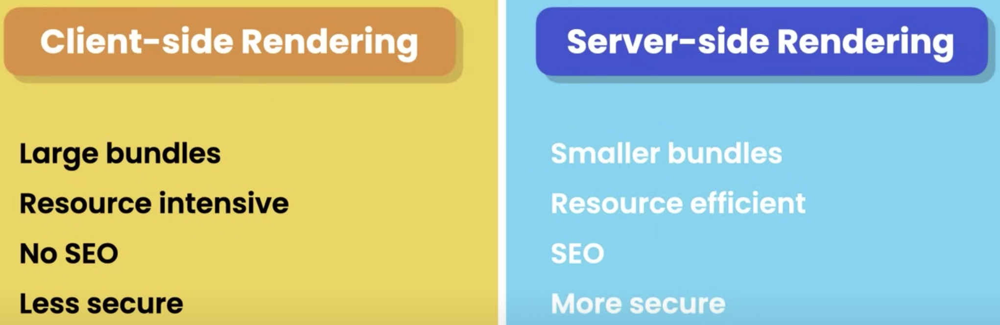
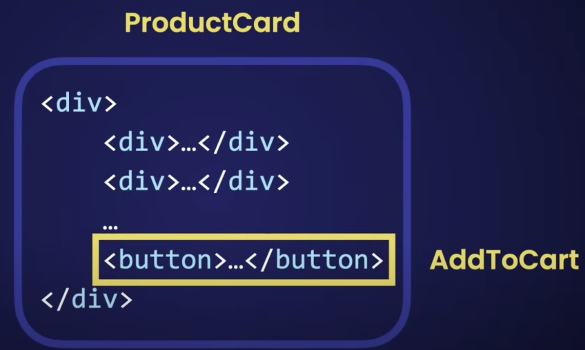
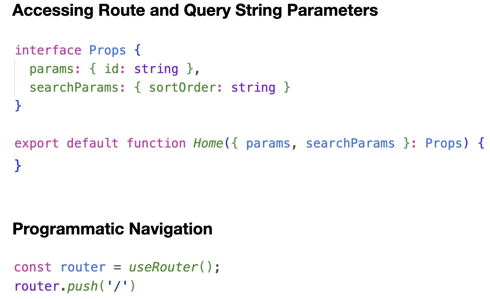

# Visit this site:

deployed site: https://next-app-ten-azure.vercel.app/

## Getting Started with local dev, backbones of this project

This is a [Next.js](https://nextjs.org/) project bootstrapped with [`create-next-app`](https://github.com/vercel/next.js/tree/canary/packages/create-next-app).

To learn more about Next.js, take a look at the following resources:

- [Next.js Documentation](https://nextjs.org/docs) - learn about Next.js features and API.
- [Learn Next.js](https://nextjs.org/learn) - an interactive Next.js tutorial.

You can check out [the Next.js GitHub repository](https://github.com/vercel/next.js/) - your feedback and contributions are welcome!
First, run the development server:

```bash
npm run dev
# or
yarn dev
# or
pnpm dev
```

Open [http://localhost:3000](http://localhost:3000) with your browser to see the result.

You can start editing the page by modifying `app/page.tsx`. The page auto-updates as you edit the file.

This project uses [`next/font`](https://nextjs.org/docs/basic-features/font-optimization) to automatically optimize and load Inter, a custom Google Font.

##### Deploy on Vercel

The easiest way to deploy your Next.js app is to use the [Vercel Platform](https://vercel.com/new?utm_medium=default-template&filter=next.js&utm_source=create-next-app&utm_campaign=create-next-app-readme) from the creators of Next.js.

Check out our [Next.js deployment documentation](https://nextjs.org/docs/deployment) for more details.

# Personal notes:

- video: https://www.youtube.com/watch?v=ZVnjOPwW4ZA
- tuto repo: https://members.codewithmosh.com/courses/enrolled/240431

When creating the app, selected the following options

- create-next-app@13.4.19
- Ok to proceed? (y) y

- ✔ What is your project named? … next_app
- ✔ Would you like to use TypeScript? Yes
- ✔ Would you like to use ESLint? Yes
- ✔ Would you like to use Tailwind CSS? Yes ----> so that we can use ctrl + space to see intelligence suggestions
- ✔ Would you like to use `src/` directory? … No
- ✔ Would you like to use App Router? (recommended) Yes
- ✔ Would you like to customize the default import alias? … No

### Adding new pages

Navigation and new pages structured is built in.
just adding new folders in the three under app directory, it will load the pages automaticaaly.
eg. adding a folder with a name for the route, and a file thats named Page.tsx (for typescript)

Navigation:
we use

> import Link from "next/link";

as we call it client side navigation to optimize what its being downloaded

## Client-side Components CSC vs Server-side components SSC

we should default to Server-side components and do as minimal Client-side components



note that server side components limit the interactivity with the user, so we use the Atomic desing to decouple a strategy.



### Pages router vs New app router

Pages router its deprecated, it does not support server components so you should stop using it

'use client' decorator. we use this to tell nextjs this file will be rendered in the browser

Fetching data:

using jsonplaceholder.typicode.com to get random data

to fetch data, whenever possible, we should fetch it from server-side components

### Caching

there are 3 places to get data.

- Memory (fast)
- File system (mid)
- Network (slow)

by default, nextjs stores data in its file system as cache. it is built in.
we need to be explicit to disable this in each fetch so for those data that changes a lot and we need it from the source.
{ cache: no-store},
or we can add: {next: { revalidate: 10 }} // this would refetch for new data every 10 seconds

### Static and Dynamic Rendering

if we hace pages or components with static data, to be render once only, payload and content will come from chache in its file system

testing static pages:
you need to build the app for production, and because next is using the default cache, it renders statically. avoiding to run a new fetch to the network. unless we add the param to the fetch built in module: { cache: "no-store" }

> npm run build // to create a new build
> npm run start // to run the prod build

when you build, you can identify which page is static or dynamic


# Next.js Fundamentals

#### Terms

- Client componentsClient-side Rendering (CSR)
- Dynamic rendering
- Node.js runtime
- Server components
- Server-side Rendering (SSR)
- Static rendering
- Static Site Generation (SSG)

#### Summary

- Next.js is a framework for building fast, and search-engine friendly applications.
- It includes a compiler for transforming and minifying JavaScript code, a Command-line Interface (CLI) for building and starting our application, and a Node.js runtime for running backend code. This enables full-stack development.
- With Next.js, we can render our components on the server and return their content to the client. This technique is called Server-side Rendering (SSR) and makes our applications search-engine friendly.
- To further improve performance, we can pre-render pages and components that have static data during the build and serve them whenever needed. This technique is called Static Site Generation (SSG).
- The new app router in Next.js 13 makes it incredibly easy to create routes. We can define route segments by creating directories. To make a route public, we add a page file (page.js, page.jsx, or page.tsx) in the corresponding directory.
- Next.js provides the Link component to enable client-side navigation. This means as the user navigates between pages, the new content is loaded quickly and smoothly without the entire page being reloaded.
- Next.js 13 supports client and server components introduced in React 18. Client components are rendered on the client within a web browser. This technique is called Client-side Rendering (CSR) and it’s how traditional React apps work. Server components are rendered on the server within a Node.js runtime. This technique is called Server-side Rendering (SSR).
- Server components lead to reduced bundle sizes, better performance, increased search engine visibility, and enhanced security. But they cannot handle browser events, access browser APIs, or use the state or effect hooks. These functionalities are only available in client components. So we should use them whenever possible unless we need interactivity.
- All the components and pages in the /app directory are server components by default. To make a component a client component, we add the ‘use client’ directive on top of the component file.
- Server components are great for fetching data because they don’t require extra server trips, making our application faster and more search-engine friendly.
- Next.js enhances the fetch() function by adding automatic caching. This boosts performance and reduces the need to retrieve the same piece of data twice.
- In Next.js, components can be rendered at build time (called Static Rendering) or at request time (called Dynamic Rendering). If we have pages or components with static data, we can pre-render them during build time to improve our application’s performance.


# Styling

#### Terms

- CSS modules
- Daisy UI
- Global styles
- PostCSS
- Tailwind

#### Summary

- In Next.js projects, we define global styles in /app/global.css. Reserve this file for global styles that need to be applied across multiple pages and components. Avoid adding excessive styles to this file, as it can quickly grow out of hand and become difficult to maintain.
- In traditional CSS, if we define the same class in two different files, one will overwrite the other depending on the order in which these files are imported. CSS modules help us prevent this problem. A CSS module is a CSS file that is scoped to a page or component.
- During the build process, Next.js uses a tool called PostCSS to transform our CSS class names and generate unique class names. This prevents clashes between different CSS classes across the application.
- Tailwind is a widely-used CSS framework for styling application. It offers a comprehensive set of small, reusable utility classes. We can combine these classes to create beautiful user interfaces.
- DaisyUI is a component library built on top of Tailwind. It provides a collection of pre-designed and reusable components such as accordion, badge, card, etc.

#### CSS Modules.

it helps to prevent a named class does not override with other. this ocurrs when we import files with same class names,
we use css modules to separate their concern.
as the javascript engine takes care of it, we need to keep the class names as key for objects in javascript.
meaning we should not use - in names like: class-name, we use camelCase: className

#### postcss.config.js

this file helps configure so that css modules work in nextjs. the idea is to autogenerate new classnames so that even if we repeat names. they wont crash

#### Tailwind

one benefit is many classes out of the box, and whenever a component is removed with its class, if the class is not used anywhere else, then the build will not include that class anymore. helping to clean the code automatically.

#### Daisy UI

This is a boostrap for tailwind
install: https://daisyui.com/docs/install/

#### special files in Nextjs

- page.tsx: We already used this to create our pages.
- layout.tsx: Defined to create the layouts per folder.
- loading.tsx: Optional loading component can be used to show a loading state.
- error.tsx: Optional error state can be used only to show the error in a specific application part.
- template.tsx: Optional and very similar to layout, but this one will always remount on navigation, and the state is not shared.
- head.tsx: Optional to add a different <head> tag for a specific route.

#### About navigation with Link

only downloads the content of the target page.
pre-fetches link that are in portview
caches pages on the client

#### Navigation

note that next/router ----> useRouter is depricated:

> Unhandled Runtime Error
> Error: NextRouter was not mounted. https://nextjs.org/docs/messages/next-router-not-mounted

instead use next/navigation

#### Suspense and Loading

we can think about 3 ways of showing loading states.
1 directly in a parent component
2 wrapping the children in a suspense component to handle loading states.
we do this by adding the element in the layout file
3 using the special file loading.tsx to get loading states under the hood

#### Handling not found files

there is a build in function within next to navigate to a not-found.tsx view: notFound()

> import { notFound } from "next/navigation";
> if (id > 10) notFound();

when a new not-found.tsx page is added to the same level of a page.tsx, then that will be the view rendered.

#### Error handling

in dev mode (npm run dev) we can see a stacktrace of the error, but in production build, a generic error page is displayed.

> Application error: a server-side exception has occurred (see the server logs for more information).
> Digest: 3461117963

we can create a custom error page with the special file: error.tsx (it must be a client-component wuth 'use client' clause)
error pages can be at any level of the application

Note: for specific errros in the layout.tsx , we need a special catcher file for errors, name global-error.tsx at the app level as well.

the error event is automatically passed to the component, so we can do stuff with it. look at the error.tsx file for the example

Login error in prod: Sentry (sentry.io/welcome/)

# Routing and Navigation (summary)

#### terms:

- Client cache, Dynamic routes, Layout, Prefetching

#### Summary

- The new App router in Next.js uses convention over configuration to define routes. It looks for special files such as page.tsx, layout.tsx, loading.tsx, route.tsx, etc.
- With the App router, we can colocate our pages and their building blocks (eg components, services, etc). This helps us better organize our projects as we can keep highly related files next to each other. No need to dump all the components in a centralized components directory.
- A dynamic route is one that takes one or more parameters. To add parameters to our routes, we wrap directory names with square brackets (eg [id]).
- In standard React applications, we use the state hook for managing component state. In server-rendered applications, however, we use query string parameters to keep state. This also allows us to bookmark our pages in specific state. For example, we can bookmark a filtered and sorted list of products.
- We use layoutfiles (layout.tsx) to create UI that is shared between multiple pages. The root layout (/app/layout.tsx) defines the common UI for all our pages. We can create additional layouts for specific areas of our application (eg /app/admin/layout.tsx).
- To provide smooth navigation between pages, the Link component prefetches the links that are in the viewport.
- As the user moves around our application, Next.js stores the page content in a cache on the client. So, if they revisit a page that already exists in the cache, Next.js simply grabs it from the cache instead of making a new request to the server. The client cache exists in the browser’s memory and lasts for an entire session. It gets reset when we do a full refresh.

## File Conventions

page.tsx
layout.tsx
loading.tsx
not-found.tsx
error.tsx



# Building an API

conventional file: route.tsx
NextRequest and NextResponse are used as middlewares
api objects validation with Zod -> https://zod.dev/

import { z } from "zod";

const schema = z.object({
name: z.string().min(3),
// email: z.string().email(),
// age: z.number(),
});

export default schema;

///// ----- /////

const validation = schema.safeParse(body);
if (!validation.success)
return NextResponse.json(
{ error: validation.error.errors },
{ status: 400 }
// if error is found, this is the structure:
// {
// "error": [
// {
// "code": "too_small",
// "minimum": 3,
// "type": "string",
// "inclusive": true,
// "exact": false,
// "message": "String must contain at least 3 character(s)",
// "path": [
// "name"
// ]
// }
// ]
// }
);

# Building API (summary):

#### Terms:

- API endpoint
- Data validation library: Zod
- HTTP Methods and status codes
- Route handlers
- Postman tool

#### Summary

- To build APIs, we add a route file (route.tsx) in a directory. Note that within a single directory, we can either have a page or a route file but not both. •In route files, we add one or more route handlers. A route handler is a function that handles an HTTP request.
- HTTP requests have a method which can be GET (for getting data), POST (for creating data), PUT/PATCH (for updating data), and DELETE (for deleting data).
- HTTP protocol defines standard status codes for different situations. A few commonly used ones include: 200 (for success), 201 (when a resource is created), 400 (indicating a bad request), 404 (if something is not found), and 500 (for internal server errors).
- To create an object, the client should send a POST request to an API endpoint and include the object in the body of the request.
- We should always validate objects sent by clients. We can validate objects using simple if statements but as our applications get more complex, we may end up with complex and nested if statements.
- Data validation libraries, such as Zod, allow us to define the structure of our objects using a simple syntax, taking care of all the complexity involved in data validation.
- To update an object, the client should send a PUT or PATCH request to an API endpoint and include the object in the request body. PUT and PATCH are often used interchangeably. However, PUT is intended for replacing objects, while PATCH is intended for updating one or more properties.
- To delete an object, the client should send a DELETE request to an API endpoint. The request body should be empty.
- We can use Postman for testing APIs. With Postman we can easily send HTTP requests to API endpoints and inspect the responses.

# Database integration with Prisma

Testing and installing MySQL engine and workbench tool locally - https://dev.mysql.com/downloads/mysql/
we also added prisma ORM https://www.prisma.io/
installed the extension in VScode for Prisma official and install npm i primsa
we use npx prisma to do the setup
creating models, they can have relationships as well as db tables. https://www.prisma.io/docs/concepts/components/prisma-schema/data-model
creating migrations with npx prisma migrate dev

whenver we edit a model, we want to format it:

> npx prisma format

whenever we change or add a model, we need to run the prisma migration

> npx prisma migrate dev

created the prisma client instance to be using in the code

> import { PrismaClient } from "@prisma/client";
> const prisma = new PrismaClient();
> export default prisma;

note: to use Prisma client instance in development, we need to add additional code to prevent the refresh (2twice load) from dev to create too many instances in every import.
see: https://www.prisma.io/docs/guides/other/troubleshooting-orm/help-articles/nextjs-prisma-client-dev-practices

#### Terms

- Database engine: mysql
- Object Oriented Mapper (ORM) - Prisma
- Models and migrations

#### Summary

- We use databases to permanently store data. There are many database engines available. Some of the popular ones are MySQL, PostgreSQL, MongoDB, etc.
- To connect our applications to a database, we often use an Object-relational Mapper (ORM). An ORM is a tool that sits between a database and an application. It’s responsible for mapping database records to objects in an application. Prisma is the most widely-used ORM for Next.js (or Node.js) applications.
- To use Prisma, first we have to define our data models. These are entities that represent our application domain, such as User, Order, Customer, etc. Each model has one or more fields (or properties).
- Once we create a model, we use Prisma CLI to create a migrationfile. A migration file contains instructions to generate or update database tables to match our models. These instructions are in SQL language, which is the language database engines understand.
- To connect with a database, we create an instance of PrismaClient. This client object gets automatically generated whenever we create a new migration. It exposes properties that represent our models (eg user).

#### Key commands

Setting up Prisma

> npx prisma init

Format schema file

> npx prisma format

Creting and running a migration

> npm prisma migrate dev
